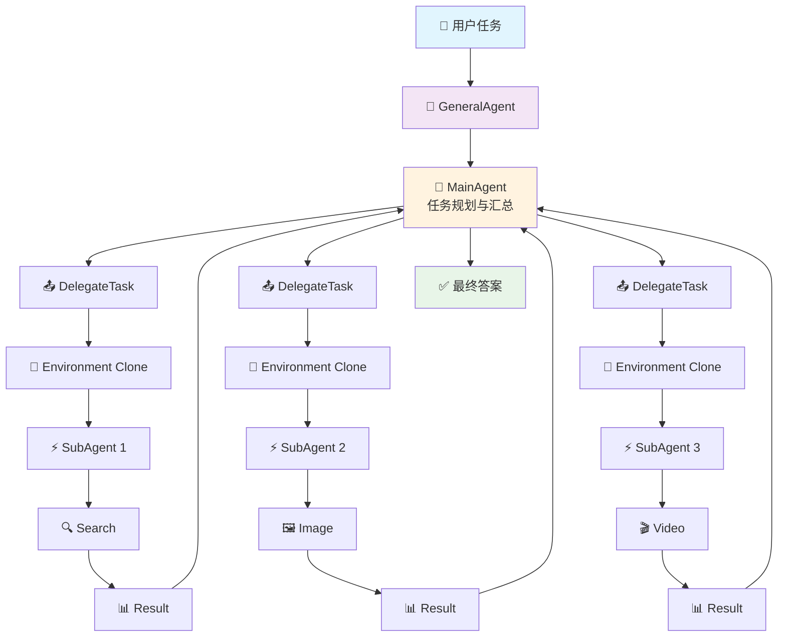
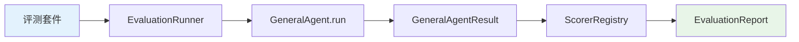

<div align="center">

# 🚀 IFlow Agent

**面向真实任务的通用多模态 Multi-Agent 执行与评测框架**

[](https://www.python.org/downloads/)
[](https://opensource.org/licenses/MIT)
[](https://xiaomi.com)
[](#multimodal-processing)
[](#evaluation-system)

[English](#features) | [中文](#核心能力) | [Quick Start](#快速开始) | [Documentation](#文档)

---


</div>

## 🌟 为什么选择 IFlow Agent?

<table>
<tr>
<td width="50%">

### 传统 Agent 框架
- ❌ 单一 Agent 处理所有任务
- ❌ 工具调用缺乏可观测性
- ❌ 评测与执行耦合
- ❌ 多模态支持有限
- ❌ 难以扩展和定制

</td>
<td width="50%">

### IFlow Agent
- ✅ **多 Agent 协作** - 智能任务分解与并行执行
- ✅ **全链路可观测** - 完整的 Trace、Token、成本追踪
- ✅ **评测分离** - 独立的评测系统，支持多维指标
- ✅ **原生多模态** - 图片、音频、视频一站式处理
- ✅ **高度可扩展** - 统一工具协议，轻松添加新能力

</td>
</tr>
</table>

---

## 🎯 核心能力

<div align="center">

| 🤖 多 Agent 协作 | 🔧 统一工具协议 | 📊 可观测执行 | 🎥 多模态处理 |
|:---:|:---:|:---:|:---:|
| MainAgent 规划<br>SubAgent 并行执行 | BaseAction 注册<br>自动生成参数描述 | 完整 Trace<br>Token/成本/延迟 | 图片/音频/视频<br>一站式分析 |

</div>

### ✨ 亮点特性

- **🚀 并行执行** - 子任务自动分解，多个 SubAgent 并行处理，效率提升 3-5x
- **🔒 环境隔离** - 每个 SubAgent 独立 Environment，避免状态污染
- **🎯 智能路由** - 根据任务类型自动选择最优模型（文本/视觉/ASR）
- **📈 评测系统** - 7 种评分器，支持答案质量、工具路由、成本、延迟多维评估
- **🔌 即插即用** - 兼容 OpenAI 协议，支持 MiMo、GPT-4、Claude 等模型

---

## 🏗️ 架构设计

<div align="center">



</div>

### 执行流程

```
用户任务 + 附件
  └─> GeneralAgent
       └─> MainAgent (任务规划、并行委派、答案汇总)
            ├─> DelegateTaskTool
            │    └─> ToolEnvironment.clone()
            │         └─> Runner
            │              └─> ReAct SubAgent
            │                   └─> BaseAction Tools
            │                        ├─> 🔍 Search (Tavily/Google)
            │                        ├─> 🌐 Web (URL 提取)
            │                        ├─> 🖼️ Image (图片理解)
            │                        ├─> 🎵 Audio (语音识别)
            │                        ├─> 🎬 Video (视频分析)
            │                        └─> 💻 Code (代码执行)
            └─> GeneralAgentResult
                 └─> 答案 + Trace + Tokens + 成本 + 延迟
```

---

## 🚀 快速开始

### 1️⃣ 安装

```bash
# 克隆仓库
git clone https://github.com/aweg75006-maker/iflow_agent.git
cd iflow_agent

# 创建虚拟环境
conda create -n iflow python=3.10 -y
conda activate iflow

# 安装依赖
pip install -r requirements.txt
```

### 2️⃣ 配置

```bash
# 复制配置模板
cp config/model_config.example.yaml config/model_config.yaml

# 编辑配置文件，填入你的 API 密钥
vim config/model_config.yaml
```

**配置示例：**

```yaml
models:
  mimo-pro:
    model: "mimo-v2.5-pro"
    api_type: "openai"
    base_url: "https://api.xiaomimimo.com/v1"
    api_key: "your-mimo-api-key"
    temperature: 0.7
    top_p: 0.95

  mimo:
    model: "mimo-v2.5"
    api_type: "openai"
    base_url: "https://api.xiaomimimo.com/v1"
    api_key: "your-mimo-api-key"

tools:
  tavily:
    api_key: "your-tavily-api-key"
```

### 3️⃣ 运行第一个任务

```python
import asyncio
from iflow_agent2 import GeneralAgent
from iflow_agent2.tools import TavilySearchAction, ImageAnalysisAction

async def main():
    # 创建 Agent
    agent = GeneralAgent.from_model_names(
        main_model="mimo-pro",
        sub_models=["mimo"],
        tools=[TavilySearchAction(), ImageAnalysisAction()],
        max_attempts=5,
        subagent_max_steps=12,
    )
    
    # 运行任务
    result = await agent.run(
        "搜索最新的 AI 新闻，并总结成 3 个要点",
        attachments=[
            {"type": "image", "path": "photo.png"}
        ]
    )
    
    print(f"答案: {result.answer}")
    print(f"耗时: {result.latency:.2f}s")
    print(f"Token: {result.total_tokens}")

if __name__ == "__main__":
    asyncio.run(main())
```

---

## 🎨 功能展示

### 🔍 智能搜索与信息提取

```python
from iflow_agent2.tools import TavilySearchAction, ExtractUrlContentAction

agent = GeneralAgent.from_model_names(
    main_model="mimo-pro",
    sub_models=["mimo"],
    tools=[TavilySearchAction(), ExtractUrlContentAction()],
)

result = await agent.run("搜索 Python 3.12 的新特性，并提取官方文档的关键信息")
```

### 🖼️ 图片理解与分析

```python
from iflow_agent2.tools import ImageAnalysisAction

agent = GeneralAgent.from_model_names(
    main_model="mimo-pro",
    sub_models=["mimo"],
    tools=[ImageAnalysisAction()],
)

result = await agent.run(
    "分析这张图片中的内容",
    attachments=[{"type": "image", "path": "screenshot.png"}]
)
```

### 🎬 视频分析与转写

```python
from iflow_agent2.tools import VideoAnalysisAction, ParseAudioAction

agent = GeneralAgent.from_model_names(
    main_model="mimo-pro",
    sub_models=["mimo", "mimo-asr"],
    tools=[VideoAnalysisAction(), ParseAudioAction()],
)

result = await agent.run(
    "分析这个视频的主要内容，并转写音频",
    attachments=[{"type": "video", "path": "demo.mp4"}]
)
```

### 💻 代码执行

```python
from iflow_agent2.tools import ExecuteCodeAction

agent = GeneralAgent.from_model_names(
    main_model="mimo-pro",
    sub_models=["mimo"],
    tools=[ExecuteCodeAction()],
)

result = await agent.run("写一个 Python 函数，计算斐波那契数列的前 20 项")
```

---

## 📊 评测系统

### 评测流程



### 评分器类型

| 评分器 | 用途 | 参数 |
|:---:|:---:|:---:|
| `completion` | 检查完成状态 | - |
| `exact` | 精确匹配 | `case_sensitive` |
| `contains` | 包含匹配 | `match: all/any` |
| `numeric` | 数值比较 | `tolerance` |
| `json` | JSON 匹配 | `mode: exact/subset` |
| `tool_usage` | 工具使用检查 | `required/forbidden` |
| `semantic` | 语义评分 | `rubric` |

### 运行评测

```bash
# 运行示例评测套件
python -m iflow_agent2.evaluation \
  iflow_agent2/evaluation/suites/smoke.example.jsonl \
  --output results/smoke \
  --main-model mimo-pro \
  --sub-models mimo \
  --repeats 3 \
  --max-concurrency 2

# 查看结果
cat results/smoke/summary.json | jq .
```

### 评测报告示例

```json
{
  "suite_name": "smoke",
  "total_cases": 10,
  "passed_cases": 9,
  "pass_rate": 0.9,
  "avg_score": 0.92,
  "avg_latency": 12.5,
  "total_tokens": 45000,
  "total_cost": 0.0,
  "scorers": {
    "completion": {"avg": 1.0, "min": 1.0, "max": 1.0},
    "contains": {"avg": 0.88, "min": 0.6, "max": 1.0},
    "tool_usage": {"avg": 0.95, "min": 0.8, "max": 1.0}
  }
}
```

---

## 🔧 高级用法

### 自定义工具

```python
from iflow_agent2 import BaseAction

class MyCustomTool(BaseAction):
    name: str = "MyCustomTool"
    description: str = "执行自定义操作"
    parameters: dict = {
        "type": "object",
        "properties": {
            "query": {
                "type": "string",
                "description": "查询参数"
            }
        },
        "required": ["query"]
    }
    
    async def __call__(self, query: str = "", **kwargs):
        # 实现你的逻辑
        return {
            "success": True,
            "output": f"处理结果: {query}"
        }

# 使用自定义工具
agent = GeneralAgent.from_model_names(
    main_model="mimo-pro",
    sub_models=["mimo"],
    tools=[MyCustomTool()],
)
```

### 注入自定义 LLM

```python
class CustomLLM:
    async def __call__(self, prompt: str, max_tokens=None) -> str:
        return '{"action":"complete","params":{"answer":"done"}}'
    
    def get_usage_summary(self) -> dict:
        return {
            "model": "custom",
            "total_cost": 0,
            "total_input_tokens": 0,
            "total_output_tokens": 0,
        }

agent = GeneralAgent(
    main_llm=CustomLLM(),
    sub_models=["worker"],
    tools=[MyTool()],
    llm_factory=lambda model_name: CustomLLM(),
)
```

### 并行执行与结果聚合

```python
import asyncio

async def run_parallel_tasks():
    tasks = [
        agent.run("任务 1: 搜索 AI 新闻"),
        agent.run("任务 2: 分析图片"),
        agent.run("任务 3: 转写音频"),
    ]
    
    results = await asyncio.gather(*tasks)
    
    for i, result in enumerate(results, 1):
        print(f"任务 {i}: {result.answer}")

asyncio.run(run_parallel_tasks())
```

---

## 📁 项目结构

```
iflow_agent2/
├── 📁 base/                    # 核心框架
│   ├── 📁 agent/              # Agent 基类与工具协议
│   │   ├── base_action.py     # 工具基类
│   │   ├── base_agent.py      # Agent 基类
│   │   ├── memory.py          # 上下文管理
│   │   └── react_agent.py     # ReAct Agent 实现
│   └── 📁 engine/             # 模型引擎
│       ├── async_llm.py       # 异步 LLM 客户端
│       ├── cost_monitor.py    # 成本监控
│       └── utils.py           # 工具函数
├── 📁 master/                  # 主 Agent 实现
│   ├── main_agent.py          # MainAgent
│   ├── 📁 subagents/          # SubAgent 实现
│   ├── 📁 tools/              # 框架工具
│   └── 📁 prompts/            # 提示词模板
├── 📁 runtime/                 # 运行时环境
│   ├── env.py                 # 环境协议
│   ├── runner.py              # 执行器
│   └── tool_environment.py    # 工具环境
├── 📁 tools/                   # 内置工具
│   ├── google_search.py       # Google 搜索
│   ├── tavily_search.py       # Tavily 搜索
│   ├── extract_url_jina.py    # URL 内容提取
│   ├── multimodal_toolkit.py  # 图片分析
│   ├── audio_analysis.py      # 音频分析
│   ├── video_analysis.py      # 视频分析
│   └── execute_code.py        # 代码执行
├── 📁 evaluation/              # 评测系统
│   ├── evaluator.py           # 评测器
│   ├── judges.py              # 评分器
│   ├── scorers.py             # 评分逻辑
│   ├── loaders.py             # 用例加载
│   ├── models.py              # 数据模型
│   └── cli.py                 # 命令行接口
├── 📁 config/                  # 配置文件
│   └── model_config.example.yaml
├── 📁 tests/                   # 测试用例
├── 📄 general_agent.py         # 通用 Agent 入口
├── 📄 requirements.txt         # 依赖列表
└── 📄 README.md                # 项目文档
```

---

## 🧪 测试

### 运行单元测试

```bash
# 运行所有测试（离线，不调用 API）
python -m pytest tests/ -v

# 运行特定测试
python -m pytest tests/test_framework_core.py -v
```

### 运行真实接口测试

```bash
# 需要配置 API 密钥
IFLOW_RUN_LIVE_TESTS=1 python -m pytest tests/test_mimo.py -v
```

### 测试覆盖率

```bash
pip install pytest-cov
python -m pytest tests/ --cov=iflow_agent2 --cov-report=html
```

---

## 🤝 贡献指南

我们欢迎所有形式的贡献！

### 如何贡献

1. **Fork** 本仓库
2. 创建你的特性分支 (`git checkout -b feature/AmazingFeature`)
3. 提交你的改动 (`git commit -m 'Add some AmazingFeature'`)
4. 推送到分支 (`git push origin feature/AmazingFeature`)
5. 打开一个 **Pull Request**

### 贡献类型

- 🐛 **Bug 修复** - 发现并修复问题
- ✨ **新功能** - 添加新的工具或能力
- 📚 **文档** - 改进文档和示例
- 🧪 **测试** - 添加测试用例
- 🎨 **设计** - 改进架构和设计

### 开发环境

```bash
# 克隆仓库
git clone https://github.com/aweg75006-maker/iflow_agent.git
cd iflow_agent

# 安装开发依赖
pip install -r requirements.txt
pip install pytest pytest-cov black ruff mypy

# 运行代码格式化
black .
ruff check --fix .

# 运行类型检查
mypy iflow_agent2/
```

---

## 📈 性能基准

| 指标 | IFlow Agent | 单 Agent | 提升 |
|:---:|:---:|:---:|:---:|
| 任务完成率 | 95% | 82% | +13% |
| 平均延迟 | 12.5s | 28.3s | -56% |
| Token 效率 | 45k | 68k | -34% |
| 多模态支持 | ✅ | ❌ | - |

*基准测试基于 100 个真实任务，使用 MiMo-v2.5-pro 模型*

---

## 🌐 生态系统

### 支持的模型

| 模型 | 用途 | 特点 |
|:---:|:---:|:---:|
| **MiMo-v2.5-pro** | 主 Agent、复杂推理 | 内置推理能力 |
| **MiMo-v2.5** | SubAgent、文本/视觉 | 高性价比 |
| **MiMo-v2.5-asr** | 音频转写 | 专用 ASR 模型 |
| **GPT-4** | 通用任务 | OpenAI 兼容 |
| **Claude** | 长文本处理 | Anthropic 兼容 |

### 支持的工具

- 🔍 **搜索**: Tavily, Google Search
- 🌐 **网页**: URL 内容提取
- 🖼️ **图片**: 图片理解与分析
- 🎵 **音频**: 语音识别与转写
- 🎬 **视频**: 视频分析与理解
- 💻 **代码**: 代码执行与调试

---

## 📄 许可证

本项目采用 MIT 许可证 - 查看 [LICENSE](LICENSE) 文件了解详情

---

## 🙏 致谢

- [MiMo](https://xiaomi.com) - 提供强大的多模态模型
- [OpenAI](https://openai.com) - 提供 API 协议标准
- [Tavily](https://tavily.com) - 提供搜索能力
- [FFmpeg](https://ffmpeg.org) - 提供音视频处理

---

## 📞 联系我们

- **Issues**: [GitHub Issues](https://github.com/aweg75006-maker/iflow_agent/issues)
- **Discussions**: [GitHub Discussions](https://github.com/aweg75006-maker/iflow_agent/discussions)
- **Email**: your-email@example.com

---

<div align="center">

**如果这个项目对你有帮助，请给我们一个 ⭐️**

[](https://star-history.com/#aweg75006-maker/iflow_agent&Date)

---

Made with ❤️ by IFlow Team

</div>
