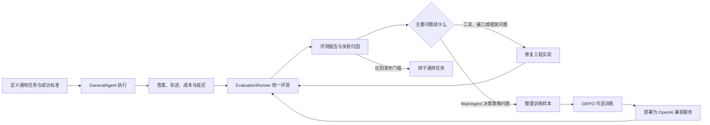

# IFlow Agent 完整工作流

IFlow Agent 的主流程不是“运行、评测、训练”三个互不相关的功能，而是一个有明确准入条件的持续改进闭环：



## 三个系统的职责

| 系统 | 输入 | 核心模块 | 输出 | 是否默认运行 |
|---|---|---|---|---|
| 通用任务执行 | 用户指令、附件、工具 | `GeneralAgent`、`MainAgent`、`Runner` | `GeneralAgentResult` | 是 |
| 任务评测 | 固定用例、成功标准、候选 Agent | `EvaluationRunner`、`ScorerRegistry` | `summary.json`、`results.jsonl`、`results.csv` | 仅显式执行 |
| 强化学习 | 训练集、基础模型、奖励函数 | `extensions/reinforcement_learning/grpo` | 模型检查点 | 仅显式执行 |

三者共享的是 MainAgent 的决策协议和工具语义，不共享运行状态。普通 Agent 进程不会加载训练框架，评测代码也不会改变 Agent 的执行逻辑。

## 阶段一：处理通用任务

入口是 `GeneralAgent.run()`。一次运行的主要过程是：

1. `MainAgent` 根据用户任务决定调用 `delegate_task` 还是 `complete`。
2. `DelegateTaskTool` 为每个子任务创建隔离的 `ToolEnvironment`。
3. `ReActAgent` 在允许的工具范围内执行子任务。
4. `MainAgent` 汇总子任务结果并返回最终答案。
5. `GeneralAgentResult` 保存答案、状态、主从 Agent token、成本、耗时和轨迹。

这里的 `status == "done"` 只表示流程正常完成，不表示答案一定正确。正确性必须由下一阶段的评测器判断。

## 阶段二：建立评测基线

评测套件用 JSONL、JSON 或 YAML 描述。每条用例至少包含任务和评分方式：

```json
{
  "id": "search-001",
  "instruction": "搜索并总结指定主题",
  "expected": "必须出现的关键事实",
  "category": "web-research",
  "scorers": [
    {"type": "completion", "weight": 1},
    {"type": "contains", "weight": 2},
    {"type": "tool_usage", "required_tools": ["TavilySearchAction"]}
  ],
  "pass_threshold": 0.8
}
```

建议分三层运行：

1. **Smoke 层**：少量用例验证配置、工具路由和报告链路。
2. **能力层**：按搜索、代码、多模态、规划等类别统计质量。
3. **回归层**：冻结的核心用例，用于比较代码、提示词或模型变更前后的结果。

示例命令：

```bash
python -m iflow_agent2.evaluation \
  iflow_agent2/evaluation/suites/smoke.example.jsonl \
  --output iflow_agent2/evaluation/results/baseline \
  --main-model mimo-pro \
  --sub-models mimo \
  --repeats 3
```

评测报告至少关注：

- `pass_rate` 和 `weighted_score`：任务质量；
- `agent_completion_rate` 和 `error_rate`：执行稳定性；
- `repeat_score_stddev`：同一任务重复运行的波动；
- `avg_latency_seconds`、token 和成本：效率；
- 分类和 scorer 明细：问题集中在哪种能力。

## 阶段三：先归因，再决定是否使用 RL

并非所有低分都应该进入强化学习。

| 失败类型 | 典型表现 | 正确处理方式 |
|---|---|---|
| 工具实现问题 | 参数解析错误、文件读取失败、返回结构不一致 | 修工具并做回归测试 |
| API 或环境问题 | 密钥失效、超时、FFmpeg 缺失 | 修配置和运行环境 |
| 能力缺失 | 没有所需工具或模型不支持该模态 | 增加能力或调整模型路由 |
| 提示词问题 | 输出格式偶发错误、约束表达不清 | 先修改 Prompt |
| 策略问题 | 持续错误拆解、选错工具、过早完成 | 才考虑 SFT 或 GRPO |

只有当失败主要来自 MainAgent 的决策策略，并且已经积累了足够多经过审核的任务与轨迹时，RL 才值得投入。

## 阶段四：构造训练数据

训练数据和最终评测数据必须隔离：

| 数据集 | 用途 | 是否可参与训练 |
|---|---|---|
| Train | 生成候选决策、计算 GRPO 奖励 | 是 |
| Dev | 调整奖励权重、Prompt 和训练超参数 | 否 |
| Frozen Test | 最终训练前后对比 | 否 |

不要直接把 `evaluation/results` 自动转成训练集。建议先人工或规则审核轨迹，去掉以下样本：

- 因 API、权限或工具异常导致的失败；
- 预期答案本身有歧义或已经过时；
- 含有敏感数据或不可复现外部状态；
- 只靠偶然工具返回得到正确答案的轨迹。

GRPO 扩展使用 `prompt`、`ground_truth` 和 `extra_info`。`extra_info` 可以包含任务、成功标准、历史上下文和可选参考决策。具体字段见 [强化学习扩展说明](../extensions/reinforcement_learning/README.md)。

## 阶段五：可选 GRPO 训练

训练是一个完全独立的显式操作：

```bash
VERL_DIR=/path/to/verl \
BASE_MODEL_PATH=/path/to/base-model \
TRAIN_FILE=/path/to/train.parquet \
VAL_FILE=/path/to/dev.parquet \
bash extensions/reinforcement_learning/grpo/train_grpo.sh
```

奖励函数对每个 MainAgent 决策计算四个维度：

```text
总奖励 = 10% 格式正确性
       + 10% 动作有效性
       + 20% 工具与子任务合理性
       + 60% 决策质量
```

前两项本地确定性计算；后两项由配置的 Judge 模型评分。Judge 不可用时仍保留确定性分数，但这类异常必须在训练监控中单独统计，不能把它当成正常的低奖励样本。

## 阶段六：部署并回归评测

训练产物不能直接替换线上模型。先通过 vLLM 等服务暴露为 OpenAI 兼容接口，再在本地模型配置中增加一个独立别名：

```yaml
models:
  iflow-policy-candidate:
    model: "iflow-policy-candidate"
    api_type: "openai"
    base_url: "http://127.0.0.1:8000/v1"
    api_key: "local-service-key"
```

然后使用与基线完全相同的冻结套件、重复次数、工具列表和 SubAgent 模型进行评测：

```bash
python -m iflow_agent2.evaluation \
  iflow_agent2/evaluation/suites/regression.jsonl \
  --output iflow_agent2/evaluation/results/rl-candidate \
  --main-model iflow-policy-candidate \
  --sub-models mimo \
  --repeats 3
```

只有在任务质量达到门槛，并且稳定性、成本和延迟没有不可接受退化时，候选模型才进入通用任务配置。否则回到失败归因或训练数据阶段继续迭代。

## 当前实现边界

当前仓库已经具备：

- 通用任务执行与完整轨迹；
- 多维任务评测和报告；
- MainAgent 决策奖励回调；
- 通用 verl GRPO 启动模板。

当前仓库刻意不包含：

- 自动把评测集变成训练集的脚本；
- 训练数据和模型权重；
- 自动启动 GPU 训练或部署的后台任务；
- 未经实际对照实验验证的训练收益。

这些边界避免评测泄漏，也确保核心 Agent 仍可在不安装训练依赖的环境中独立运行。
